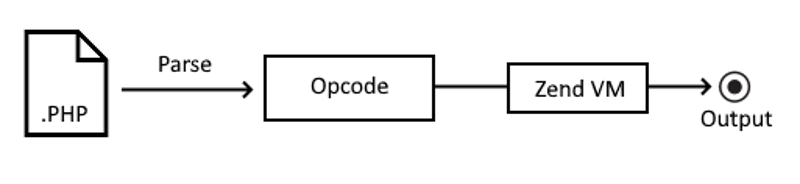

Se você é desenvolvedor PHP a algum tempo e gosta de acompanhar as novidades da linguagem, provavelmente já ouviu falar que o compilador JIT será adicionado no PHP 8. Se não ouviu, essa foi a [votação](https://wiki.php.net/rfc/jit#proposed_voting_choices) que tornou isso realidade. 90% dos core contributors votaram para essa feature entrasse no PHP 8. Desde o PHP 7 tivemos várias mudanças com o foco em aumento de perfomance, mas creio que esse seja um grande avanço na linguagem. Essa feature é bem grande e seu desenvolvimento foi iniciado a 2 anos atrás, sendo que ainda temos mais 1 ano até o lançamento do PHP 8. Nesse artigo vamos entrar um pouco no que teremos com esse novo avanço. 

 

## O que é o JIT ? 

Talvez você não tenha ouvido falar sobre o JIT antes, então vou dar uma explicação rápida. Você provavelmente já sabe que o PHP é uma linguagem insterpretada, isso significa que o código não necessáriamente é compilado antes de rodar (como o C/C++). Ao invés disso, a engine do PHP irá ler o seu código e roda-lo. Em outras palavras, você cria código de script e dá isso para o PHP rodar.

PHP possui uma maquina virtual chamada Zend VM. Ela é responsável por ler e rodar o seu código PHP, mas antes disso, o seu código será lido e transformado em OPCode, que é a linguagem que a Zend VM entende. 

 

Sendo assim, nós precisamos de um primeiro passo de compilação e então outro passo de interpretação, como exemplificado na imagem acima. Para ganhar performance, nós temos o chamado OPCache (OPCode Cache), que guarda o resultado da compilação para que não seja necessário compilar novamente da próxima vez. 

O PHP irá funcionar de maneira um pouco diferente a partir de agora. Por baixo dos panos o PHP utilizará uma biblioteca chamada Dynamic Assembler [DynASM](https://luajit.org/dynasm.html). Essa biblioteca foi desenvolvida inicialmente para ser o compilador JIT da linguagem Lua, mas também é possível utiliza-la para outras projetos. Esse foi o caso do PHP. Utilizando isso, o PHP é capaz de transformar os OPCodes em códigos de maquina específicos. Assim, o PHP consegue "pular" a etapa de interpretar o código feita pela Zend VM e o executa diretamente.

Mas será que fica realmente rápido ? 

Esse vídeo abaixo mostra uma comparação entre o PHP com o compilador JIT e a versão anterior (sem o JIT). 

<iframe width="560" height="315" src="https://www.youtube.com/embed/dWH65pmnsrI" frameborder="0" allow="accelerometer; autoplay; encrypted-media; gyroscope; picture-in-picture" allowfullscreen></iframe>


Nesse exemplo do vídeo, o PHP foi utilizado para criar uma imagem 3D. Sabemos que esse não é o uso comum da linguagem. Esse exemplo foi dado porque agora nosso código é compilado em linguagem de máquina e roda diretamente pela CPU, ao invés de passar pelo interpretador, então o principal ganho de performance é relacionado ao uso de CPU. Se fosse feito um teste com uma aplicação web padrão, normalmente dependeria de I/O (Banco de dados, Upload de arquivos, Requests HTTP e etc). Então, para obter um resultado "limpo", foi colocado esse cenário de renderização de imagem 3D. 


Desde o PHP 7.0, o tópico `performance` tem sido mais abordado do que nunca, em parte graças à competição com o HHVM do facebook (que também tem um compilador JIT). Várias aspectos da linguagem como OPCache, estruturas de dados, e etc estão sendo otimizados pouco a pouco. Hoje, chegamos em um ponto onde não há mais muita coisa que iria trazer um aumento significativo de desempenho nesses tópicos.  

Além disso, a performance do PHP para uma linguagem de servidor pode ser considerado muito boa, esquecendo o PHP lento do passado. Então agora podemos pensar em expandir as capacidades do PHP para novas áreas como análise de dados, renderização 3D / 2D e mais. 

No passado, código de alta performance era escrito com extensões C/C++ ao invés de pacotes PHP normais. Por exemplo, o `phpredis` é 6-7 vezes mais rápido do que o `predis`. Se o código PHP é compilado ao invés de interpretado, nós teremos pacotes PHP com a mesma performance de extensões escritas em C/C++. 

Agora vamos a um experimento: 

Para conseguirmos realizar esse teste da forma mais prática possível, iremos utilizar essa imagem docker (akondas/php:8.0-cli-alpine). Nesse experimento iremos rodar uma simples função de fibonacci. 

Com o docker já instalado e configurado na sua maquina, podemos criar uma função fibonacci chamada `fibo.php`, com o código a seguir: 

```php
function fibonacci($n){
    return(($n < 2) ? 1 : fibonacci($n - 2) + fibonacci($n - 1));
}

$n = 32;
$start = microtime(true);
$fibonacci = fibonacci($n);
$stop = microtime(true);

echo sprintf("Fibonacci(%s): %s\nTime: %s", $n, $fibonacci, $stop-$start);
```

Agora iremos rodar essa função, executando primeiro em um contrainer PHP 8, mas sem o JIT habilitado. Para fazer isso utilize o comando: 

```bash
docker run -it -v "$PWD":/usr/src/app -w /usr/src/app \
akondas/php:8.0-cli-alpine php fibo.php

Fibonacci(32): 3524578
Time: 0.17796015739441 
```

Para fianlizar o nosso teste, iremos rodar agora com o JIT habilitado e vamos ver o que acontece.

```bash
docker run -it -v "$PWD":/usr/src/app -w /usr/src/app \
akondas/php:8.0-cli-alpine php -dzend_extension=opcache.so \
-dopcache.enable_cli=1 -dopcache.jit_buffer_size=500000000 \
-dopcache.jit=1235 fibo.php

Fibonacci(32): 3524578
Time: 0.050444841384888
```

Como podemos ver, a diferença é impressionante. `0.1779` vs `0.0504`. Com o JIT habilitado tivemos um aumento de `252%` na execução.

Certamente o JIT será uma melhoria que irá beneficiar muito o ecosistema PHP, então, vamos aproveitar! 

### Referências:
Esse texto é uma tradução/adaptação dos seguintes artigos: 

- 🙏 https://medium.com/jp-tech/try-out-jit-compiler-with-php-8-0-a020e6aeb3e5
- 🙏 https://arkadiuszkondas.com/how-to-run-php-8-with-jit-support-using-docker/

Aos autores meu agradecimento pelo conteúdo de qualidade.
